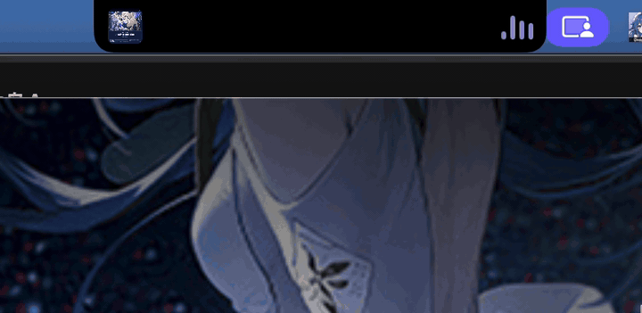
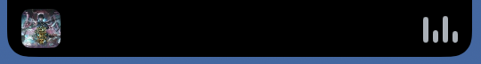
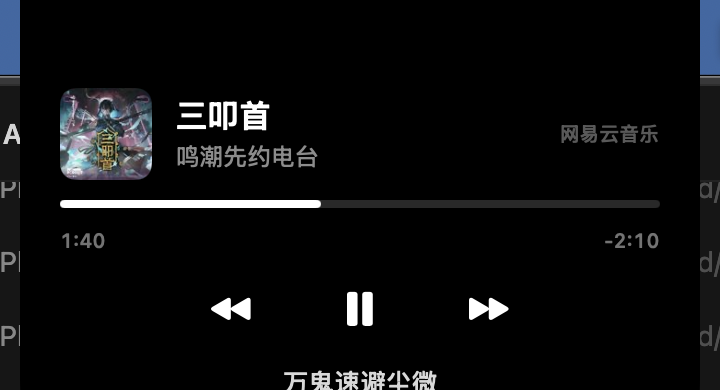

# NotchIsland · 刘海灵动岛

把 MacBook 的刘海变成 iPhone 式灵动岛的 macOS 菜单栏应用。原生 Swift + AppKit + SwiftUI，无第三方依赖，单可执行文件 + 一个媒体信息助手。

<p align="center">
  
</p>
<p align="center">
  
  
</p>

> 左：收起态——专辑封面 + 随音乐律动的声纹（颜色取自封面主色调）；
> 右：展开态——真封面、歌名/歌手、进度条、播放控制、逐行同步歌词。

## 直接下载

不想自己编译？去 [Releases](https://github.com/nanami-0713/notch-island/releases/latest) 下载打包好的 `NotchIsland-vX.zip`，解压拖进「应用程序」即可。首次打开被 Gatekeeper 拦截属正常（未公证）：系统设置 → 隐私与安全性 → 「仍要打开」，或 `xattr -cr /Applications/NotchIsland.app`。详细安装步骤见 Release 说明。

## 致谢与参考

- 本项目的交互设计参考了知名 macOS 灵动岛软件 **[Alcove](https://tryalcove.com/)**（付费、闭源）：刘海贴边布局、悬停展开、媒体 HUD、文件暂存等交互均以其为蓝本自行实现，未使用其任何代码与资源。
- [mediaremote-adapter](https://github.com/ungive/mediaremote-adapter)（BSD-3-Clause，已 vendor 于 `vendor/`）：解决 macOS 15.4+ 封锁 MediaRemote 私有框架后拿不到系统级"正在播放"的问题。原理见下文。

## 功能

- **刘海无缝延伸**：自动探测刘海几何，黑色岛体与物理刘海融为一体；收起态左右"翼"非对称展开（左封面/图标、右文字/声纹），内容永远不会钻进刘海底下
- **弹簧形变动画**：120Hz 逐帧弹簧驱动，可中断可重定目标；收起方向钳制最小宽度，任何时刻不露出物理刘海
- **正在播放**：真封面、进度条（播放速率 + 时间戳插值平滑）、歌名/歌手、来源标签、上一首/播放暂停/下一首；支持 Music / Spotify / 网易云音乐 / 酷狗（含 iOS 转制的酷狗概念版）/ QQ 音乐等——理论上所有向系统上报 Now Playing 的播放器都能显示
- **同步歌词**：按歌名+歌手在网易云曲库匹配 LRC，按播放进度逐行显示；菜单可开关；电台混排标题自动拆分搜索
- **音量 / 亮度 HUD**：F11/F12、F1/F2 调节时岛内显示进度条。授予"辅助功能"权限后拦截媒体键、**隐藏系统自带大 HUD**（alcove 同款体验）
- **触控板手势**：悬停岛上 双指下拉=展开、上拉=收起、左右划=切歌（一次手势只触发一次，惯性不误触）
- **剪贴板动态 / 充电提醒 / 25 分钟专注计时**
- **文件暂存中转站**：拖文件到岛即暂存，支持在 Finder 中显示、删除、取出全部（移回原文件夹）、拷贝全部
- **开机自启动**（SMAppService）

## 工作原理（ macOS 15.4+ 的三道墙与翻法）

| 能力 | 系统限制 | 本项目做法 |
| --- | --- | --- |
| 正在播放 | macOS 15.4 起 MediaRemote 私有框架对第三方二进制返回空 | 把 [mediaremote-adapter](https://github.com/ungive/mediaremote-adapter) 编成 dylib，交给 Apple 自签、自带 MediaRemote 权限的 `/usr/bin/perl` 做宿主 dlopen，每 2 秒 `get --now` 轮询"已定格"元数据（事件流会推换歌中间态，轮询天然过滤）+ 本地插值平滑进度 |
| 亮度读写 | Apple Silicon 无 IODisplayConnect；macOS 15.x 连 CoreDisplay 框架都已移除 | dlopen 缓存驻留的 DisplayServices（`DisplayServicesGet/SetBrightness`） |
| 媒体键 | 系统无公开接口 | CGEventTap 拦截 NX 媒体键（需辅助功能权限），自调音量/亮度并吃掉系统 HUD；无脚本词典的播放器用模拟媒体键控制 |

## 构建与运行

要求：macOS 13+（刘海屏体验最佳，无刘海屏自动退化为顶部居中虚拟岛）、Xcode Command Line Tools。

```bash
./scripts/build.sh          # swift build release + 打包 + 签名 → build/NotchIsland.app
open build/NotchIsland.app
```

签名说明：脚本优先用名为 `NotchIsland Dev` 的本地自签代码签名证书（没有则自动回退 ad-hoc）。ad-hoc 签名每次重新构建后，"辅助功能"授权都会失效需重新勾选；创建一个自己的自签证书（钥匙串访问 → 证书助理 → 创建证书 → 类型选"代码签名"）并命名为 `NotchIsland Dev`，即可让授权跨重建有效。

首次使用会请求两类系统权限：

1. **辅助功能**（系统设置 → 隐私与安全性 → 辅助功能）：拦截媒体键、隐藏系统 HUD、模拟媒体键控制播放。不授权也能用，但音量/亮度为"岛内 HUD + 系统 HUD"并存。
2. **自动化**（播放音乐时弹窗）：AppleScript 兜底通路控制 Music/Spotify 等。拒绝仅影响兜底通路。

## 使用

| 操作 | 效果 |
| --- | --- |
| 悬停岛 | 轻微变宽（peek） |
| 单击岛 | 展开 / 收起面板 |
| 悬停 + 双指下拉 / 上拉 | 展开 / 收起 |
| 悬停 + 双指左右划 | 上一首 / 下一首 |
| 点击其他 app 或空白处 | 自动收起 |
| 右键岛 / 菜单栏图标 | 展开收起、专注计时、歌词开关、隐藏系统 HUD、自启动、退出 |
| 拖文件到岛 | 暂存并自动展开列出 |

## 已知限制

- 播放器元数据质量取决于播放器本身：个别电台/歌单会把歌名、歌手混排在同一字段（酷狗概念版居多），此时歌名展示与歌词匹配会打折扣；数据里没有的信息（如只上报歌手名）无法凭空恢复
- 系统级歌词接口不存在，岛内歌词来自网易云公开接口按"歌名+歌手"搜索匹配，纯音乐/小众曲目可能无歌词
- 媒体信息与亮度依赖私有框架/未公开通路，不保证未来 macOS 版本可用
- 本项目仅用于个人学习与自用，请自行承担使用私有框架的相关风险

## License

MIT © 2025 nanami-0713。`vendor/mediaremote-adapter` 为 BSD-3-Clause（见其目录内 LICENSE）。
